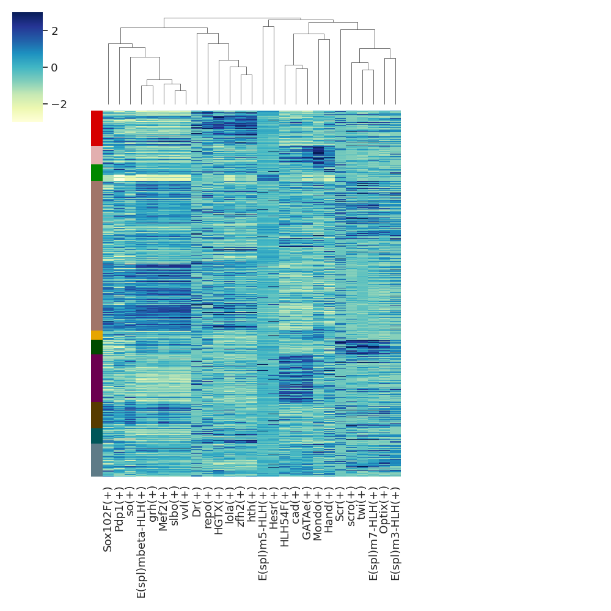
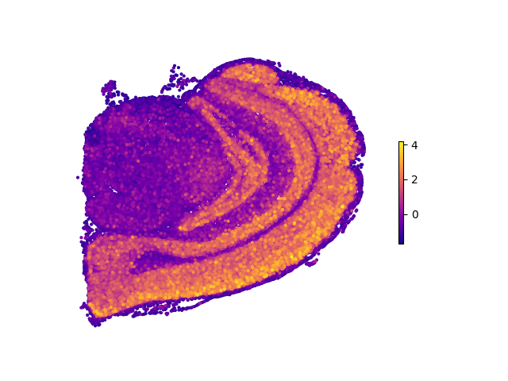
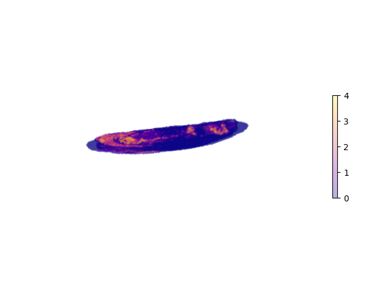

# SpaGRN
A comprehensive tool to infer TF-centered, spatial gene regulatory networks for the spatially resolved transcriptomics (SRT) data.

## Overview
SpaGRN is an open-source Python package for inferring gene regulatory networks (GRNs) based on spatial gene expression data using GPLv3 license. The model takes into account the spatial proximity of genes and TF binding to infer their regulatory relationships. The package is particularly useful for analyzing spatially resolved gene expression data.

RRID: SCR_023451

we provide two modules to infer the co-expressed and co-localized gene network:
* spatially-aware cross-correlation (SCC) model 
* spatial-proximity-graph (SPG) model 
  
## Examples

* Stereo-seq Mouse Brain
* Stereo-seq *Drosophila* Embryo and Larvae

All input SRT data and related TF database can be inquired or directly downloaded from http://www.bgiocean.com/SpaGRN/
We also provide an interactive 3D GRN atlas database, covering different GRN inference tools for different SRT datasets generated by different SRT sequencing platforms (http://www.bgiocean.com/SpaGRN/). 


# Installation
To install the latest version of SpaGRN:
```å
git clone https://github.com/BGI-Qingdao/SpaGRN.git
cd SpaGRN
python setup.py sdist
pip install dist/spagrn-1.0.0.tar.gz
```
Alternatively, you can install SpaGRN via conda using the following command:
```
conda install spagrn -c bioconda
```
SpaGRN can be imported as:
```
from spagrn import InferRegulatoryNetwork as irn
from spagrn import PlotRegulatoryNetwork as prn
```

Dependencies
```
Pandas, numpy, scanpy, matplotlib, and seaborn are required to be pre-installed
```


# Usage
The package provides functions for loading data, preprocessing data, reconstructing gene network, and visualizing the inferred GRNs. The main functions are:
* Load and process data
* Compute TF-gene similarities
* Create modules
* Perform motif enrichment and determine regulons
* Calculate regulon activity level across cells
* Visualize network and other results

## Example workflow:
```
from spagrn import InferRegulatoryNetwork as irn

if __name__ == '__main__':  #notice: to avoid concurrent bugs, please do not ignore this line!
    database_fn='xxx'
    motif_anno_fn='xxx'
    tfs_fn='xxx'
    # Load data
    data = irn.read_file('data.h5ad')
    # Preprocess data
    data = irn.preprocess(data)
    # Initialize gene regulatory network
    grn = irn(data)
    # run main pipeline
    grn.main(database_fn,
             motif_anno_fn,
             tfs_fn,
             num_workers=cpu_count(),
             cache=False,
             save=True,
             method=method,
             prefix=prefix,
             noweights=True)
```

## Visualization
SpaGRN offers a wide range of data visualization methods.
### 1. Heatmap
```
# read data from previous analysis
data = irn.read_file('data.h5ad')
data <- irn.preprocess(data)
auc_mtx = pd.read_csv('auc.csv', index_col=0)
# alternative, extract data from the grn object
data = grn.data
auc_mtx = grn.auc_mtx

# plot 
prn.rss_heatmap(data,
            auc_mtx,
            cluster_label='annotation',
            rss_fn='regulon_specificity_scores.txt'),
            topn=5,
            save=True)  
```


### 2. Spatial Plots
Plot spatial distribution map of a regulon on a 2D plane:
```
from spagrn import PlotRegulatoryNetwork as prn

prn.plot_2d_reg(data, 'spatial', auc_mtx, reg_name='Egr3')
```


If one wants to display their 3D data in a three-dimensional fashion:
```
prn.plot_3d_reg(data, 'spatial', auc_mtx, reg_name='grh', vmin=0, vmax=4, alpha=0.3)
```

