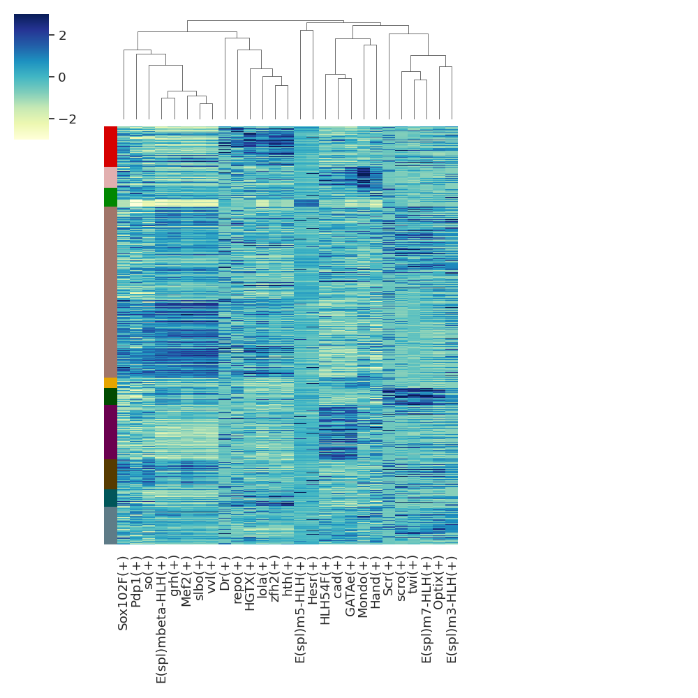
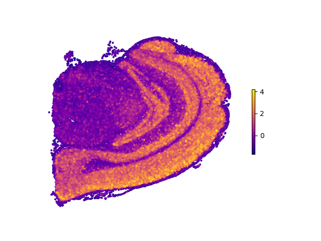
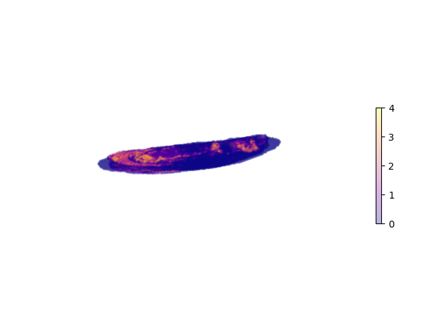

Basic Usage 
================

Workflow
---------

.. image:: ./../_static/mainpipeline.BMP
    :alt: Title figure
    :width: 700px
    :align: center

Usage
--------------

The package provides functions for loading data, preprocessing data, reconstructing gene network, and visualizing the inferred GRNs. The main functions are:

* Load and process data

* Compute TF-gene similarities

* Create modules

* Perform motif enrichment and determine regulons

* Calculate regulon activity level across cells

* Visualize network and other results

Example workflow
++++++++++++++++++++++

.. code-block:: 

	from spagrn import InferRegulatoryNetwork as irn

	if __name__ == '__main__':  #notice: to avoid concurrent bugs, please do not ignore this line!
		database_fn='mouse.feather'
		motif_anno_fn='mouse.tbl'
		tfs_fn='mouse_TFs.txt'
		
		# load Ligand-receptor data
		niches = pd.read_csv('niches.csv')
		
		# Load data
		data = irn.read_file('data.h5ad')
		
		# Preprocess data
		data = irn.preprocess(data)
		
		# Initialize gene regulatory network
		grn = irn(data)
		
		# run main pipeline
		grn.infer(database_fn,
						motif_anno_fn,
						tfs_fn,
						niche_df=niches,
				  	  num_workers=cpu_count(),
				  	  cache=False,
				 	  save_tmp=True,
				 	  c_threshold=0.2,
				 	  layers=None,
				 	  latent_obsm_key='spatial',
				 	  model='danb',
				 	  n_neighbors=30,
				 	  weighted_graph=False,
				 	  cluster_label='celltype',
				 	  method='spg',
				 	  prefix='project',
				 	  noweights=False)

All results will be save in a h5ad file, default file name is `spagrn.h5ad`.

Visualization
++++++++++++++++++++++

SpaGRN offers a wide range of data visualization methods.

1. Heatmap
************

read data from previous analysis:
~~~~~~~~~~~~~~~~~~~~~~~~

.. code-block:: 

	data = irn.read_file('spagrn.h5ad')
	
	auc_mtx = data.obsm['auc_mtx']

plot:
~~~~~~~~~~~~~~~~~~~~~~~~

.. code-block:: 

	prn.auc_heatmap(data,
					auc_mtx,
					cluster_label='annotation',
					rss_fn='regulon_specificity_scores.txt',
					topn=10,
					subset=False,
					save=True,
					fn='clusters_heatmap_top10.pdf',
					legend_fn="rss_celltype_legend_top10.pdf")  

2. Spatial Plots
************

Plot spatial distribution map of a regulon on a 2D plane:
~~~~~~~~~~~~~~~~~~~~~~~~

.. code-block:: 

	from spagrn import plot as prn

	prn.plot_2d_reg(data, 'spatial', auc_mtx, reg_name='Egr3')
	

If one wants to display their 3D data in a three-dimensional fashion:
~~~~~~~~~~~~~~~~~~~~~~~~

.. code-block:: 

	prn.plot_3d_reg(data, 'spatial', auc_mtx, reg_name='grh', vmin=0, vmax=4, alpha=0.3)

